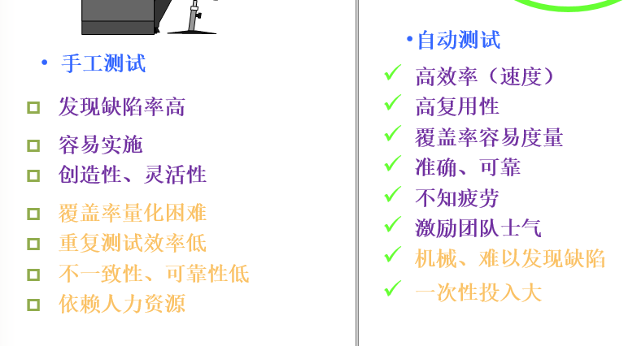
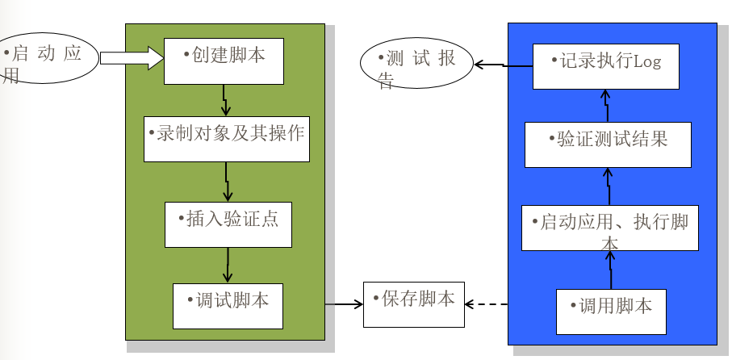

# 自动化测试
## 手工测试的局限性：
	无法覆盖所有的代码路径
	难以捕捉与时序/死锁/资源冲突/多线程相关错误
	难以实行系统负载/性能测试
	难以实现可靠性测试
	难以在短时间内完成大量测试用例
	面对测试条件组合爆炸，无能为力或效率低下
	
## 自动化测试：
	相对于手工测试存在的概念
	测试工具的使用是自动化的主要特征

***
>**自动化测试**：聚焦在测试执行，由测试工具自动的完成测试

>**测试自动化**：由系统自动完成的测试任务都已经由系统/工具/程序承担并自动执行，形成了测试的自动化，表述一个结果

***
### 自动化测试特点：
	运行速度快
	测试结果准确
	高复用性
	永不疲劳

### 自动化测试的优点：
	测试周期缩短
	提供更高质量的产品
	软件过程更加规范
	节省人力资源，降低企业成本
	充分利用硬件资源，降低企业成本
	提升团队士气

 

### 手工测试：用于系统功能逻辑测试、验收测试、适用性测试、涉及交互性的测试
### 自动测试：单元测试、集成测试、系统负载或性能、可靠性测试
***
## 自动化测试流程：

### 脚本技术：
	线性脚本：录制手工执行测试用例的脚本，录制的测试用例可以得到完整回放
	结构化脚本：类似结构化程序设计，包括各种逻辑结构，函数功能调用
	数据驱动脚本：将测试输入存储在独立文件中，非脚本文件中
	关键字驱动脚本：数据驱动脚本的逻辑扩张

### 自动结果比较：
	静态/动态比较
	简单/复杂比较
	敏感性测试/健壮性测试比较
	比较过滤器

### 测试工具：
	测试方法：
		白盒/黑盒/静态/动态
	工具来源：
		开源/商业/自主开发/第三方
	测试对象和目的：
		单元/功能/性能/测试工具、测试管理工具

***

## 测试自动化：不现实的期望注定测试自动化的失败
	可以做：
		显著降低重复手工测试的时间
		建立可靠、重复的测试、减少人为错误
		增强测试质量和覆盖率
	不可做：
		完全替代手工测试
		保证100%测试覆盖率
		弥补测试时间不足

### 测试自动化普遍存在的问题：
	不正确的观念/不现实的期望
	缺乏测试人才
	测试工具的自身的问题引起的测试质量问题
	测试脚本的优劣
	缺乏有效充分的培训
	盲目引入测试工具
	没有良好的测试环境

### 应对策略：
	正确认识测试自动化的作用
	找准测试自动化的切入点
	把测试脚本纳入整个软件开发体系
	软件程序开发和测试自动化不可分离
	合理调度测试的各种资源
	测试自动化依赖测试流程和测试用例
	降级测试自动化的投入，提高其产出

