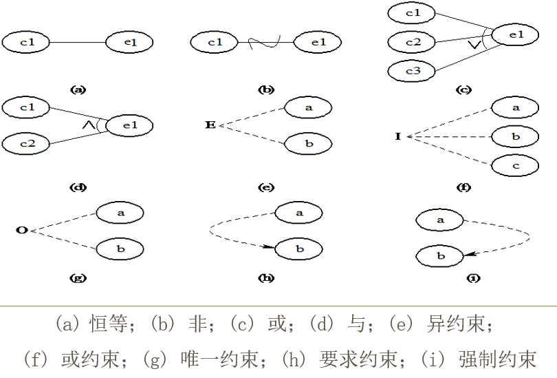

# 因果图
>检查各种输入条件的组合(针对组合输入条件)

### 因果图测试用例设计步骤：
*	分析规格说明中的输入作为因，输出作为果
*	依据因果的处理语义画出因果图
*	标出因果图的约束条件
*	将因果图转换为因果图对应的判定表
*	根据判定表设计测试用例

### 因果图四种关系
* 恒等：原因与结果是一对一的关系
* 非：原因与结果的一种否定关系
* 或：其中一个原因出现，则结果出现
* 与：所有原因出现，则结果出现

### 因果图五种约束：
* 异约束：a, b 两个不能同时成立，最多由一个可成立
* 或约束：a, b, c 至少有一个成立
* 唯一约束：a和b中必须有且仅有一个成立
* 要求约束：a出现，b必须出现
* 强制约束：a==1, b==0 \\\\ a!=1, b==0 or b==1
***

