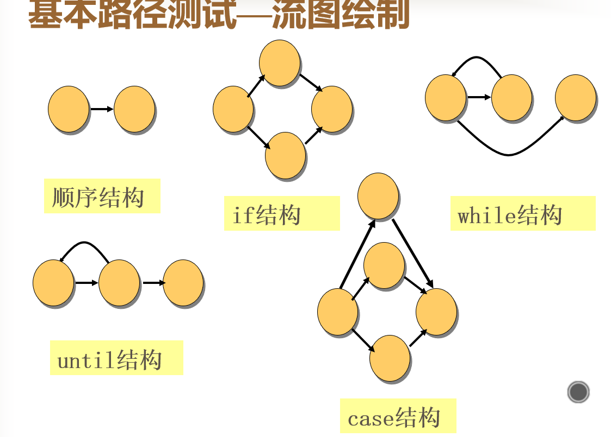

# 测试用例
### 逻辑覆盖测试的五种标准
|发现错误的能力 (弱---->强)|标准|含义说明|
|:----:|:----:|:----:|
|1|语句覆盖|每条语句**至少**执行一次
|2|判定覆盖|每一判定的**每个分支**至少执行一次
|3|条件覆盖|每一判断的**每个条件**，分别按”**真**“”**假**“至少各执行一次
|4|判定/条件覆盖|同时满足**判定覆盖**和**条件覆盖**的要求
|5|条件组合覆盖|求出判定中**所有条件的各种可能组合**值，每一**可能的条件组**合至少执行一次

### 基本路径测试
